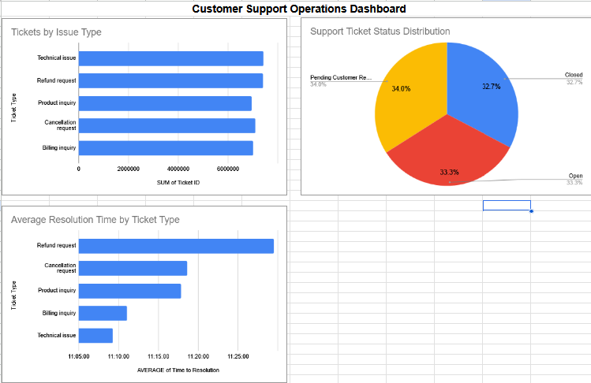

# Hi, I’m Hilary, and this is my Data Analytics Portfolio! 👋

I’m transitioning into data analytics with a strong background in tech and administrative work. I love turning raw data into clear insights and actionable dashboards that help teams make decisions.

These projects highlight my ability to:
- Clean and analyze data
- Create pivot tables and charts
- Build dashboards and visualize business insights

## Projects

### 1. BMW Global Sales Analysis (2018–2025)

- Analyzed BMW global sales data by region, model, and year
- Created pivot tables and visualizations for trends and market share
- Tools: Google Sheets, pivot tables, charts
- [View Project Folder](bmw-sales-analysis)

### 2. Customer Support Operations Dashboard

- Analyzed support ticket data for workload, issue types, and resolution times
- Built pivot tables, calculated metrics, and visualized trends
- Tools: Google Sheets, pivot tables, charts
- [View Project Folder](customer-support-operations-dashboard)
